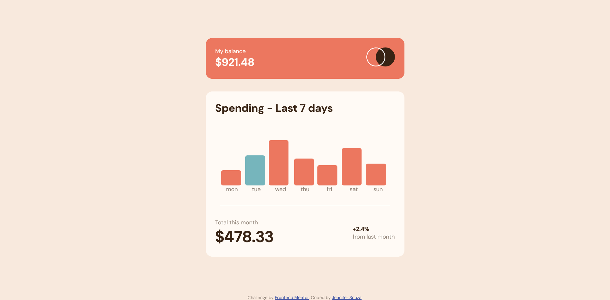

# Frontend Mentor - Expenses chart component solution

This is a solution to the [Expenses chart component challenge on Frontend Mentor](https://www.frontendmentor.io/challenges/expenses-chart-component-e7yJBUdjwt). Frontend Mentor challenges help you improve your coding skills by building realistic projects. 

## Table of contents

- [Overview](#overview)
  - [The challenge](#the-challenge)
  - [Screenshot](#screenshot)
  - [Links](#links)
- [My process](#my-process)
  - [Built with](#built-with)
  - [What I learned](#what-i-learned)
  - [Continued development](#continued-development)
  - [Useful resources](#useful-resources)
- [Author](#author)

## Overview

### The challenge

Users should be able to:

- View the bar chart and hover over the individual bars to see the correct amounts for each day
- See the current day’s bar highlighted in a different colour to the other bars
- View the optimal layout for the content depending on their device’s screen size
- See hover states for all interactive elements on the page
- **Bonus**: Use the JSON data file provided to dynamically size the bars on the chart

### Screenshot

### Links

- Solution URL: [Add solution URL here](https://your-solution-url.com)
- Live Site URL: [Add live site URL here](https://your-live-site-url.com)

## My process

### Built with

- Semantic HTML5 markup
- CSS custom properties
- Flexbox
- CSS Grid
- Mobile-first workflow
- JavaScript

### What I learned
A little bit about how to work with dates in JavaScript: how to return today's date, and how to get the day of the week from the date. I also got more good practice with CSS. I found getting the chart to display properly with hidden elements and dynamically sized content to be a little challenging at first.

### Continued development

Keep practicing with JavaScript and CSS.

### Useful resources

- [https://www.freecodecamp.org/news/javascript-get-current-date-todays-date-in-js/](https://www.freecodecamp.org/news/javascript-get-current-date-todays-date-in-js/) - This taught me how to get today's date in JS.
- [https://www.w3schools.com/jsref/jsref_getday.asp](https://www.w3schools.com/jsref/jsref_getday.asp) - This taught me how to get the day of the week from a date.

## Author

- GitHub - [Jennifer Souza](https://github.com/zoedarkweather)
- Frontend Mentor - [@zoedarkweather](https://www.frontendmentor.io/profile/zoedarkweather)
